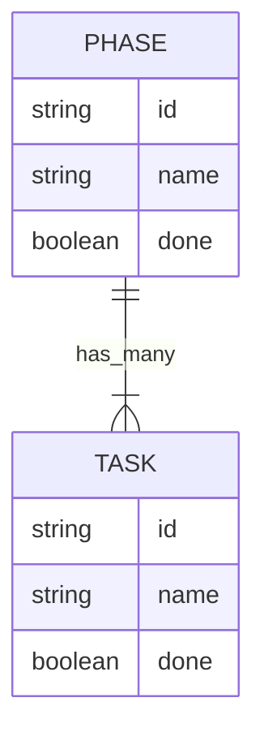

# OAK'S LAB

## Database Relationship Model

```mermaid
erDiagram
    PHASE ||--|{ TASK : has_many
    PHASE {
        string id
        string name
        boolean done
    }
    TASK {
        string id
        string name
        boolean done
    }
```
