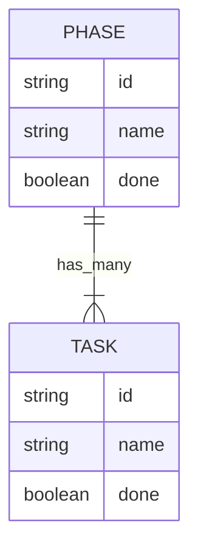

# OAK'S LAB

## Running the application

As usual: 

```sh
$ npm install
$ npm start # will start the server
$ npm test
$ npm run lint # some lint for the peace of mind
```

I've created a Insomnia collection with all the endpoints ready to be consumed. Check `insomnia.json` file!

## Database Relationship Model


